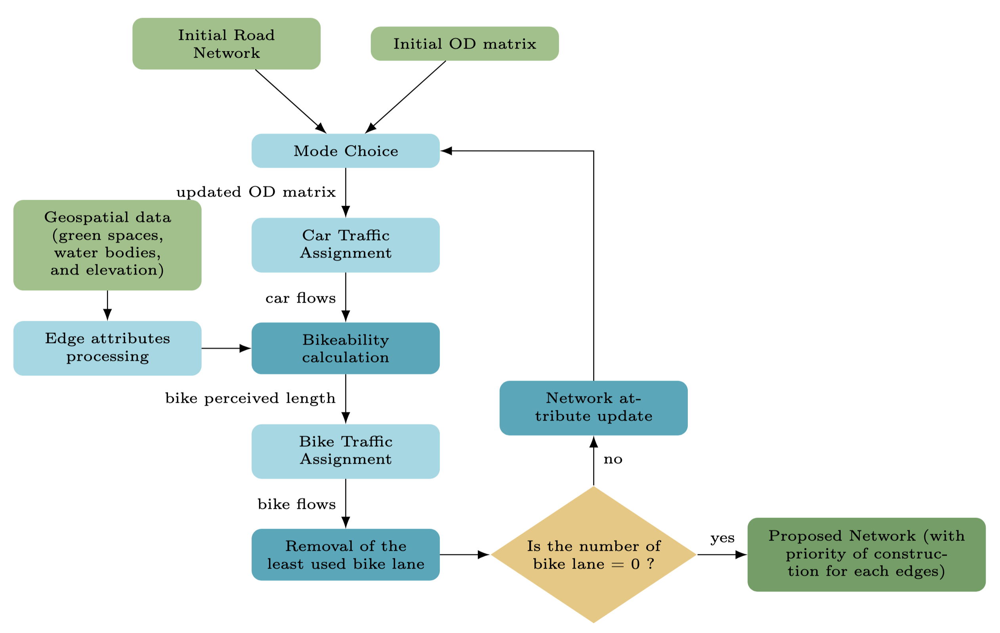

#  Bi Modal road Network Design (BMND)
This repository provides a Python-based framework for modeling, simulating, and optimizing urban transport networks.
It specifically focuses on the interaction between car and bicycle modes, incorporating mode choice modeling, traffic assignment, 
and infrastructure optimization.

The toolkit is designed to help researchers and urban planners evaluate how the introduction of cycling infrastructure 
(like bike lanes and paths) influences modal shift and overall network performance.
---

## Key Features

This design framework uses road network, traffic assignment model, mode choice model and a modified Inverted Growth Network method to propose bicycle infrastructure network.



## Repository Structure
```text
├── data/               # Data (for synthetic and real networks as .cvs files)
├── output/             # Experimental results
├── src/                # Python packages
├── requirements.txt
└── README.md
```

### Core utilies

- `utils_traffic.py`: The engine for mode choice and traffic assignment models.
- `utils_network_processing.py`: Handles network topology, bikeability calculation, coordinate processing, and the application of different infrastructure scenarios.
- `utils_optimization.py`: Contains algorithms for finding optimal infrastructure configurations based on flow and usage metrics.
- `utils_od_matrix_generator.py`: Generates synthetic demand matrices for simulation.
- `utils_plotting.py`: specialized visualization functions for spatial networks and assignment results.
- `config.py` handles general models parameters.

### Tests
- `test_traffic_assignemnts.py` and `test_mode_choice.py`: Example scripts to run traffic assigment and mode choice models.
- `test_optimization_model.py`: Example script to apply the ING method to toys networks.

## Setup

Ensure you have Python 3.8+ installed. You can install the required dependencies via pip:
```bash
pip install numpy pandas matplotlib networkx shapely geopy aequilibrae
```

### Data Structure

The toy network used in this repository is stored as two .csv files : `nodes.csv` and `edges.csv`.

- `nodes.csv` : defines the geographic points (intersections) of the network. 

| Column | Description                                                         |
|--------|---------------------------------------------------------------------|
| id     | Unique identifier for each node.                                    |
| x      | Horizontal coordinate.                                              |
| y      | Vertical coordinate.                                                |
| _z_    | _Elevation (not in use in examples provided, see slope attribute)._ |
| _type_ | _Type of node (not in use in examples provided)._                   |

- `edges.csv` : defines the road segments (connections) between the nodes.

| Column                   | Description                                                     |
|--------------------------|-----------------------------------------------------------------|
| id                       | Unique identifier for each road segment.                        |
| a_node                   | The starting node ID.                                           |
| b_node                   | The ending node ID.                                             |
| _type_car_               | _Type of car infrastructure (not in use in examples provided)._ |
| type_bike                | Infrastructure type for bicycles.                               |
| speed_car                | Define mean car speed (km/h).                                   |
| speed_bike               | Define mean bike speed (km/h).                                  |
| green_overlap_percentage | Define greenery coverage (%).                                   |
| slope                    | Define slope (%).                                               |

## Examples

The `examples.ipynb` notebook provide some examples to apply the model.

## Citation 

This repository is the code source for **Lemoalle et al., 2026, Bi-modal road network design framework using bikeability**.
